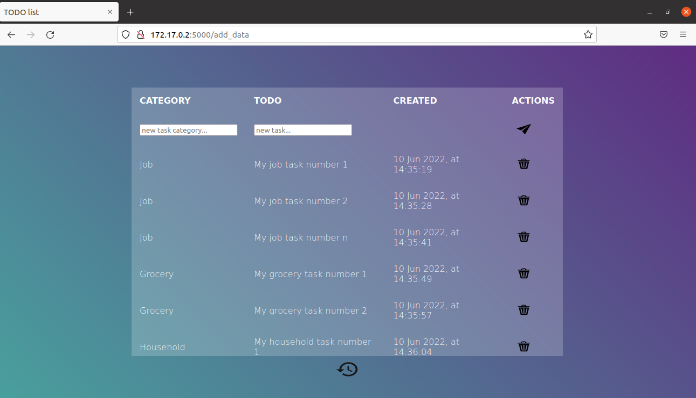
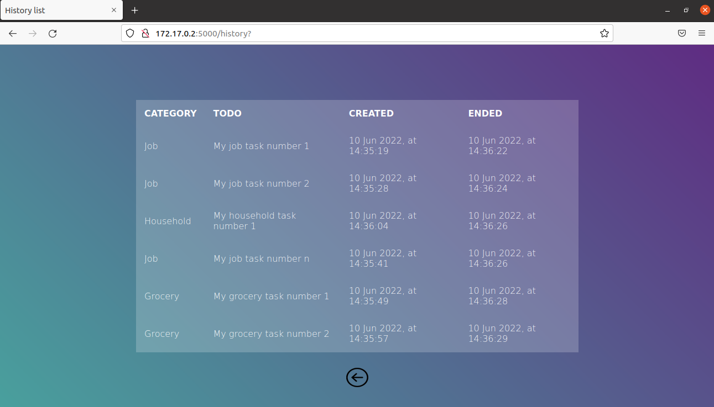

## Python TODO list

Simple TODO list application based on Flask & SQLite.

<p align="center">
  
</p>

<p align="center">
  
</p>


### Installation & Usage


First, you must have Docker installed. Then, go to the path where you want the application files and clone the project:


```bash
cd my/application/path
git clone git@github.com:Arnautt/python-todo.git
cd python-todo
```


Then, run the following commands :

```bash
sudo docker build -t my-image-name:latest .
sudo docker run --name my-container-name my-image-name:latest 
```


This will both build the image and run the container. 


**Remarks:**

- If you've stopped the container, you can restart it by running the following command : 

```bash
sudo docker start my-container-name 
```

- If you want to stop the container or remove it, run :

```bash
sudo docker stop my-container-name 
sudo docker rm my-container-name
```

